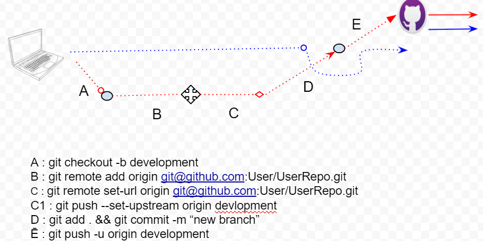

### fixing first issue

---
### cloning single branch 

---
### making branch first time

## FAQ
Q 1. Difference between stash and branches in Github.

Q 2. How to use stash number for build in Jenkins files
